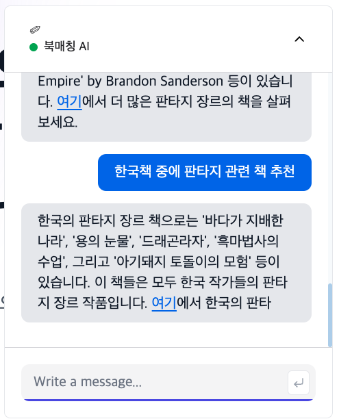

This is a [Next.js](https://nextjs.org/) project bootstrapped with [`create-next-app`]

# 프로젝트명: 북매칭 (book-matching)
> ChatGPT Open API를 이용하여 도서 추천 또는 매칭 시스템으로 AI 챗봇창을 통해 대화를 주고 받을 수 있습니다.

추천도서를 링크하면 관련 서적 리스트를 볼 수 있습니다.


## 설치 방법

OS X & 리눅스:

```sh
npm install book-matching --save
```

윈도우:

```sh
edit autoexec.bat
```

## 사용 예제


